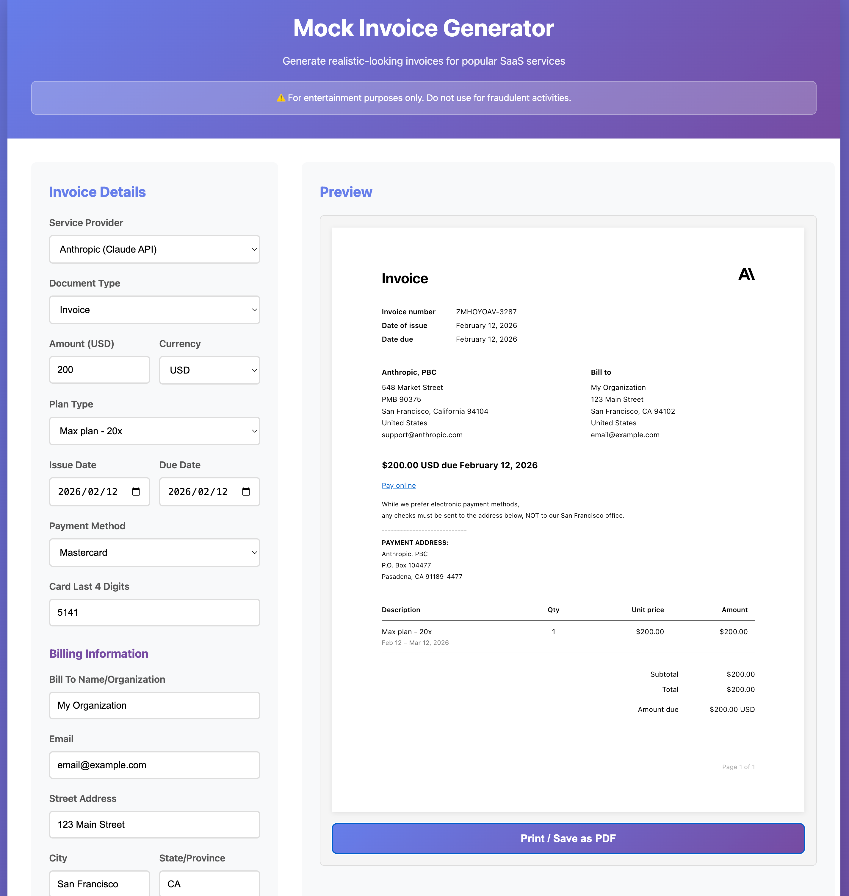

# Mock Invoice Generator

A web-based tool to generate realistic-looking mock invoices for various SaaS services.

## ⚠️ IMPORTANT DISCLAIMER

**This tool generates realistic-looking invoices that are intended for entertainment, testing, and educational purposes only.**

- Generated invoices are **NOT real documents** and have no legal or financial validity
- These invoices are **NOT marked as "MOCK" or "SAMPLE"** - they appear authentic
- **YOU are responsible for how you use these documents**
- Using fake invoices for fraud, deception, or any illegal purpose is a crime
- The creators assume **NO responsibility** for misuse of this tool

By using this tool, you acknowledge that you understand and accept full responsibility for your actions.

## Features

- 🎨 **Multiple Templates**: Support for various popular SaaS services
- 💰 **Customizable**: Adjust prices, dates, service tiers, and billing information
- 📱 **Client-Side Only**: No server required - everything runs in your browser
- 📄 **PDF Export**: Use browser's native print-to-PDF for perfect consistency
- 🔒 **Privacy First**: All data stays in your browser, nothing is sent to any server

## Supported Services

- Anthropic (Claude API)
- More coming soon...

## Screenshot

## Usage

1. Open `index.html` in your web browser
2. Select a service template
3. Customize the invoice details (amount, date, plan, etc.)
4. Click "Generate Invoice" to preview
5. Click "Print / Save as PDF" to export
   - Select "Save as PDF" in the print dialog (Mac/Windows)
   - The PDF will match the preview exactly

## Development

This is a pure client-side application built with:
- HTML5
- CSS3
- Vanilla JavaScript
- Browser native print API for PDF generation

No build process, no dependencies, no external libraries - just open `index.html` in a browser!

## Contributing

Contributions are welcome! To add a new service template:

1. Create a new template file in `src/templates/`
2. Follow the existing template structure
3. Add the template to `src/templates/index.js`
4. Submit a pull request

## Legal Notice

This tool generates realistic-looking mock invoices that are **NOT marked as mock documents**. These are not real invoices and have no legal or financial validity whatsoever.

**Using fake invoices for:**
- Tax fraud
- Insurance fraud
- Expense reimbursement fraud
- Deceiving employers, clients, or any third party
- Any other illegal purpose

**...is a CRIME that can result in serious legal consequences including fines and imprisonment.**

The creators of this tool:
- Provide this software "as-is" without any warranties
- Are not responsible for any misuse of this tool
- Do not endorse or encourage any illegal activities
- May cooperate with law enforcement if this tool is used in criminal activity

**Legitimate uses include:**
- Software testing and development
- UI/UX mockups and demos
- Educational purposes
- Personal record keeping templates

## License

MIT License - See LICENSE file for details
